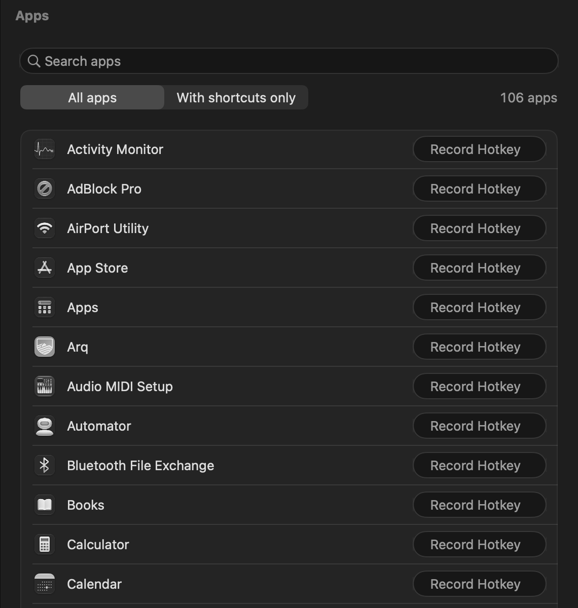
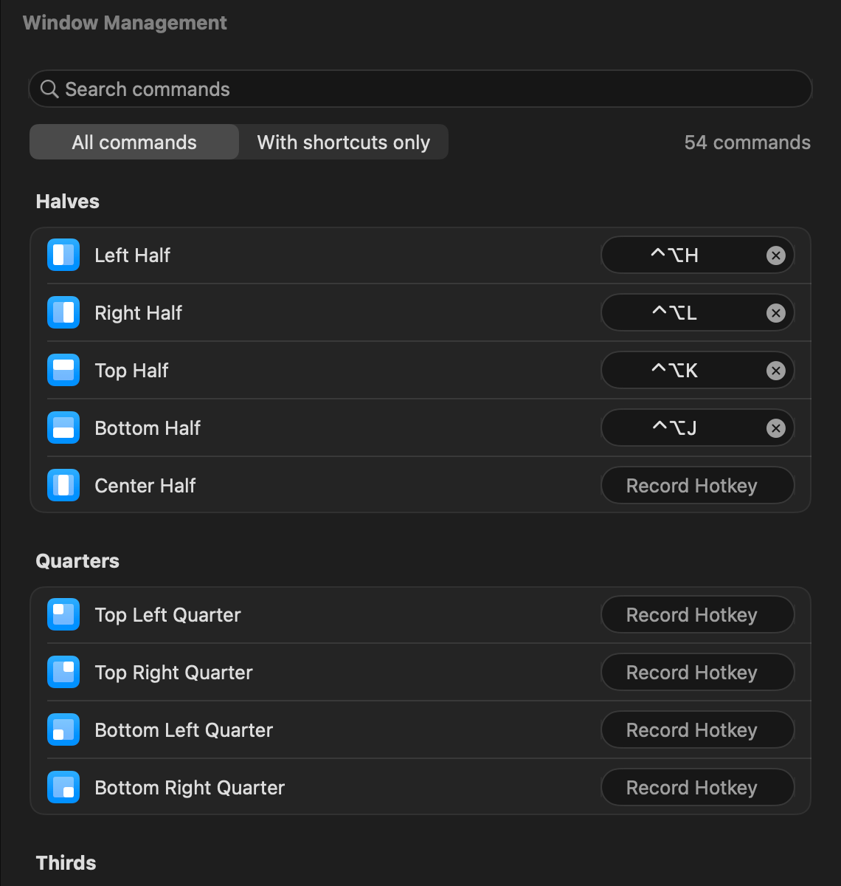
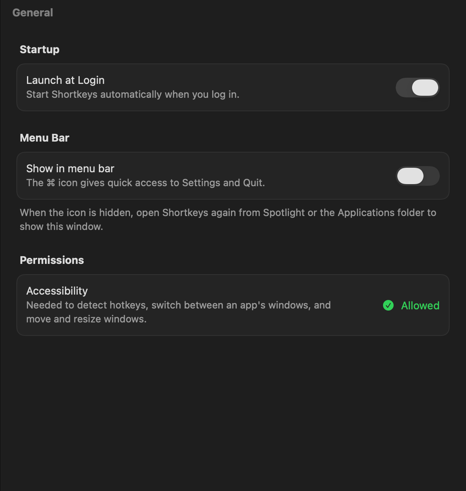
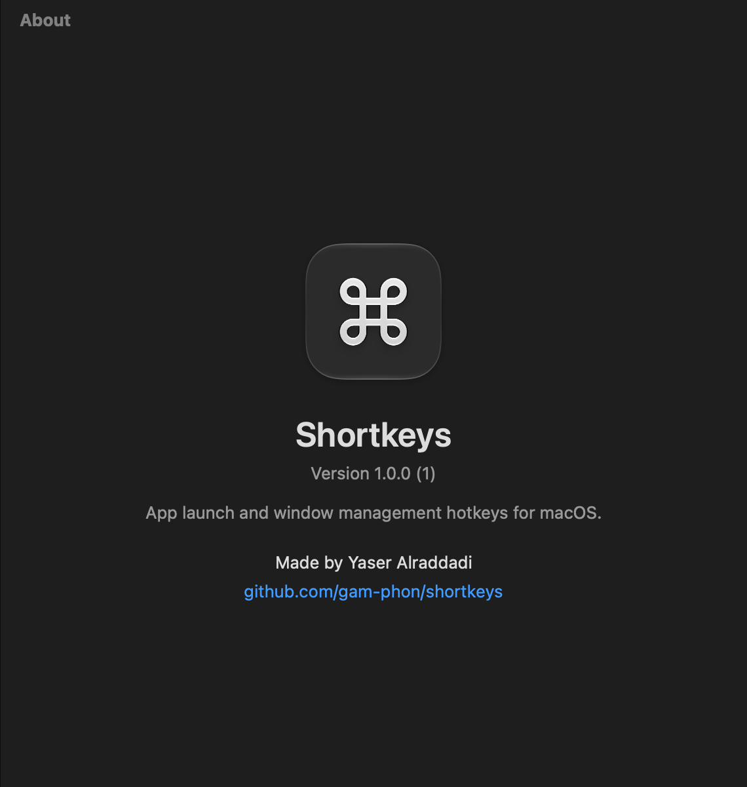

# Shortkeys

A small, native menu bar app for macOS 27+ with two features:
**hotkeys that open apps** and **hotkeys that arrange windows**.

<p>
  
  
</p>

## Features

- **App hotkeys.** A hotkey opens its app, or brings it to the front if it's
  already running. If the app is already in front, each press switches to its
  next window. Any app in `/Applications`, `/System/Applications` or
  `~/Applications` can have a hotkey.
- **Window hotkeys.** These move the window you're working in:
  - halves, quarters, thirds, fourths and sixths, including two-thirds and
    three-fourths
  - maximize, almost maximize, maximize width or height, reasonable size,
    make larger or smaller, and fullscreen
  - center, and move to any screen edge
  - restore previous size
  - next or previous display

  That's 54 commands in all, each of which can have a hotkey.

  Windows stay inside the visible part of the screen, never under the menu
  bar or Dock, and this works across multiple displays.
- **No double-booked hotkeys.** If you record a hotkey that something else
  already uses, Shortkeys asks whether to move it or keep it where it was.
- **Lightweight.** No timers or polling, and no Dock icon except while
  Settings is open. The menu bar icon can be hidden too.

Default hotkeys:

| Hotkey | Action  | Hotkey | Action      |
|--------|---------|--------|-------------|
| ⌥B     | Firefox | ⌃⌥H    | Left Half   |
| ⌥T     | WezTerm | ⌃⌥L    | Right Half  |
| ⌥G     | Claude  | ⌃⌥K    | Top Half    |
|        |         | ⌃⌥J    | Bottom Half |
|        |         | ⌃⌥M    | Maximize    |
|        |         | ⌃⌥O    | Top Center Two Thirds |

<p>
  
  
</p>

## Install

On any Mac with macOS 27, run this in Terminal:

```sh
curl -fsSL https://raw.githubusercontent.com/gam-phon/shortkeys/main/scripts/install-latest.sh | bash
```

It downloads the latest release, checks its checksum and signature, installs it
in /Applications (replacing any older copy) and opens it. Run the same command
again to update.

You can also download `Shortkeys-<version>.pkg` from
[Releases](https://github.com/gam-phon/shortkeys/releases) and open it. The
installer isn't notarized by Apple (that needs a paid developer account). So if
macOS says *"Apple could not verify…"*, click **Done**, then go to System
Settings → Privacy & Security and click **Open Anyway**.

On first launch:

1. **Allow Accessibility access.** Shortkeys explains why it needs it, then
   macOS asks you. Turn on **Shortkeys** under System Settings → Privacy &
   Security → Accessibility. You only need to do this once per Mac. Updates
   keep the permission, because every release is signed with the same
   certificate.
2. In Settings → **General**, turn on **Launch at Login**.

## Updates

Settings → General → **Updates** checks GitHub for a newer release. With "Check
automatically" on, it checks when Shortkeys starts and when you open Settings.
When an update is found, the menu bar menu also shows it.

**Update to …** does four things:

1. It downloads the release.
2. It verifies the release's SHA-256 checksum and that it's signed by the same
   certificate as the installed app. A download that fails either check is
   never installed.
3. It replaces the app in place.
4. It restarts Shortkeys.

Hotkeys, settings, Launch at Login and the Accessibility permission all carry
over.

## Uninstall

Go to Settings → General → **Uninstall…**. This removes the login item, your
hotkeys and settings, and the Accessibility entry, and moves the app to the
Trash. From Terminal, the same:

```sh
/Applications/Shortkeys.app/Contents/MacOS/Shortkeys --uninstall
```

## Build from source

You only need the Xcode Command Line Tools (`xcode-select --install`).

```sh
scripts/make-signing-cert.sh   # once: a stable signing identity (see below)
./install.sh                   # build, then install into /Applications
```

The signing certificate keeps macOS from resetting the Accessibility permission
every time you rebuild.

- `./build.sh` only builds `build/Shortkeys.app`.
- `scripts/package.sh` creates the `.pkg` and `.zip` in `dist/`.

## Releases (CI)

GitHub Actions (`.github/workflows/build.yml`) handles every push and pull
request:

1. It runs the window-layout tests.
2. It builds the app and runs its self-test (hotkey wiring checks, plus a
   screenshot of every Settings page).
3. It packages the `.pkg` and `.zip`, and uploads them and the screenshots as
   build artifacts.

If any test fails, nothing is packaged. The end-to-end test isn't run in CI,
because it needs Accessibility access to post real clicks and key presses. Run
it locally.

To publish a release, push a version tag:

```sh
git tag v1.1.0 && git push origin v1.1.0
```

### Signing

Releases are signed in CI with the "Shortkeys Dev" certificate, which is stored
in the repository secrets `SIGNING_CERT_P12` and `SIGNING_CERT_PASSWORD`. CI
checks that each release carries it, and local builds use the same certificate
from the login keychain. This one signature is what keeps the Accessibility
permission across updates, and it's what the updater checks.

To set up the certificate again (for example on a new build Mac):

1. In Keychain Access, right-click **Shortkeys Dev** → **Export…**, and save it
   as `shortkeys-dev.p12` with a password.
2. Add it to the repository as secrets:

   ```sh
   base64 -i shortkeys-dev.p12 | gh secret set SIGNING_CERT_P12 -R gam-phon/shortkeys
   gh secret set SIGNING_CERT_PASSWORD -R gam-phon/shortkeys   # paste the password
   ```

3. Delete the exported file.

## Troubleshooting

- **No hotkeys work, and the menu bar icon is a ⚠︎ triangle.** There are two
  possible causes:
  - Accessibility access is off.
  - Another app has *Secure Keyboard Entry* on. That hides keystrokes from
    every hotkey app, so Settings shows which app is holding it. If it's
    `loginwindow`, macOS left it on after unlocking: lock and unlock, or log
    out and back in.
- **The menu bar icon is hidden.** Open Shortkeys again from Spotlight or the
  Applications folder, and Settings appears.
- **Signing fails with `errSecInternalComponent`.** Run this once:
  `security set-key-partition-list -S apple-tool:,apple: -s ~/Library/Keychains/login.keychain-db`
- **Logs:**
  `/usr/bin/log show --last 10m --predicate 'subsystem == "com.yaser.shortkeys"' --info`

## Tests

```sh
scripts/test-geometry.sh                                   # window layout maths, incl. multiple displays
open build/Shortkeys.app --args --snapshot /tmp/sk-snaps   # page screenshots + hotkey wiring checks
open build/Shortkeys.app --args --e2e-test /tmp/sk-e2e     # clicks a recorder and presses ⌥N, then restores
```

Quit the running copy before running the last two. Both quit when they finish.
The end-to-end test briefly takes over the mouse and keyboard, for about 10
seconds.

## How it's built

- **Language and build.** Swift 6 (strict concurrency) and SwiftUI, for macOS
  27+, built with SwiftPM. It compiles with zero warnings and uses no
  deprecated APIs. `build.sh` assembles and signs the `.app`.
- **Hotkey storage.** Hotkeys are recorded and stored with
  [KeyboardShortcuts](https://github.com/sindresorhus/KeyboardShortcuts). It's
  vendored in `Vendor/` with a few patches, which are documented in
  `Vendor/KeyboardShortcuts/PATCHES.md`. Some let it build without Xcode, and
  others fix the recorder for apps built for macOS 26+.
- **Hotkey detection.** Key presses are detected with a CGEvent tap
  (`HotkeyCenter.swift`). Windows are moved through the Accessibility API
  (`WindowManager.swift`), with the layout maths in `WindowGeometry.swift`.
- **App state.** In the macOS 27 SDK, SwiftUI's `@State` is a compiler macro
  that only ships with Xcode, so views keep their state in `@Observable`
  models instead.
- **Opening Settings.** Settings opens through LaunchServices
  (`NSWorkspace.openApplication` on itself), because the cooperative
  `NSApp.activate()` is declined while another app is in front.

---

Made by Yaser Alraddadi.
